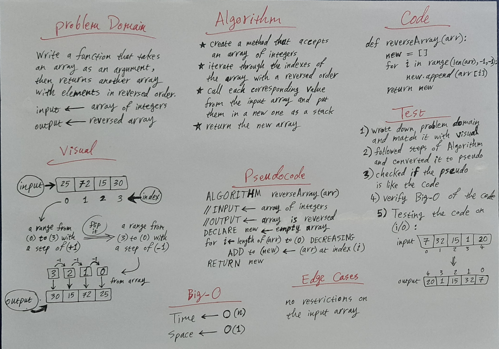

# Class 01 : Array Reverse

> [Back to main](../README.md)

    Write a function that takes an array as an argument, then return another array with elements in reversed order.

## Whiteboard Process

## Approach & Efficiency

    I reversed the indexes of the array, then assigned the corresponding elements of the new indexes from the original array to a new empty array.

    The space of the code was following the O(1), because the size of the code won't change as the input array get bigger. But, the time follows O(n), because the longer the input array gets, the longer it will take the code to be excuted.

---
---

## Another approches

  - Inverting the index when assigned

        def reverseArray2(arr):
            return [arr[len(arr)-i-1] for i in range(len(arr))]

  - Inverting the index with another way

        def reverseArray3(arr):
            return [arr[(i+1)*-1] for i in range(len(arr))]

---
