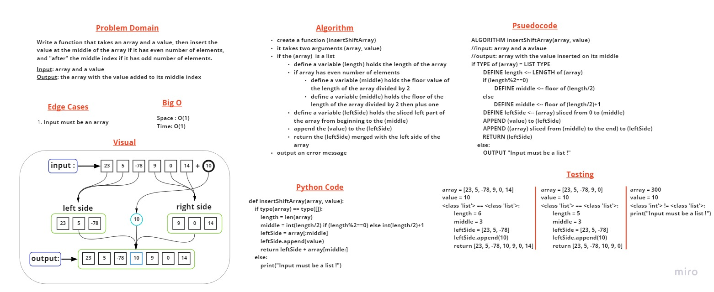

# Class 02 : Array Insert Shift

> [Back to main](../README.md)

    Write a function that takes an array and a value, then insert the value at the middle of the array if it has even number of elements, and "after" the middle index if it has odd number of elements.

## Whiteboard Process



## Approach & Efficiency

    I sliced the array into two halves, then appended the desired value between them and returned the combined three parts.

    The space and time of the code were following the O(1), because code's capacity and execution time are fixed due to the absence of loops.

---
---

## Streatch Goal

Write a function that removes an element from the middle index and shifts other elements in the array to fill the new gap.

```
def deleteArrayShift(array):
    if type(array) == type([]):
        middle = int(len(array)/2) 
        return array[:middle] + array[middle+1:]
    else:
        print("Input must be a list !")
```

---
