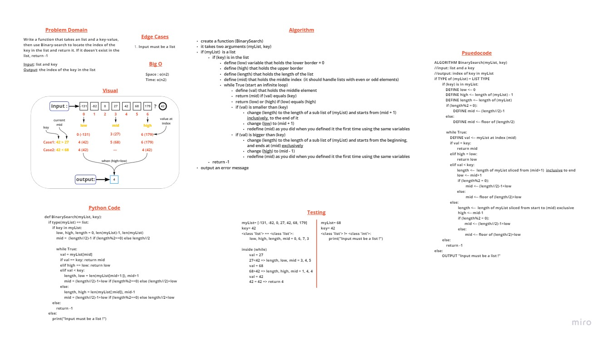

# Class 03 : Array Binary Search

> [Back to main](../README.md)

    Write a function that takes an list and a key-value, then use Binary-search to locate the index of the key in the list and return it. If it doesn't exist in the list, return -1.

## Whiteboard Process

## Approach & Efficiency

    Divide the **sorted** list into 2 prats from the middle. Check if the key value is in the first part pf the list or the second one, then slice the list where the key is located (first or second part). Keep dividing the list untill the middle value equals to the key, and return its index.

    The space and time of the code were following the O(n2), because have a while loop which has (n) times, then we have the slicing which has the internal (n). So we got (n*n) which is (n2).

---
