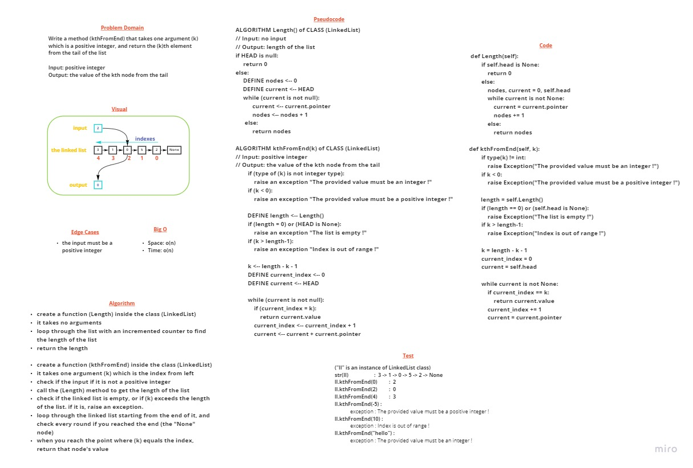

# Challenge 07 Summary: Linked List at Kth element

> [Back](../README.md)

---

Write a method (kthFromEnd) that takes one argument (k) which is a positive integer, and return the (k)th element from the tail of the list

---

## Whiteboard Process



---

## Approach & Efficiency

create a function (Length) inside the class (LinkedList), it takes no arguments, loop through the list with an incremented counter to find the length of the list, then return the length 

create a function (kthFromEnd) inside the class (LinkedList), it takes one argument (k) which is the index from left
check if the input if it is not a positive integer, call the (Length) method to get the length of the list
check if the linked list is empty, or if (k) exceeds the length of the list. if it is, raise an exception

loop through the linked list starting from the end of it, and check every round if you reached the end (the "None" node)
when you reach the point where (k) equals the index, return that node's value

the big o for both time and space is o(n), because the worst case is to loop through the whole list

---

## Solution

### The code 

```
def Length(self):
    if self.head is None:
        return 0
    else:
        nodes, current = 0, self.head
        while current is not None:
            current = current.pointer
            nodes += 1
        else:
            return nodes

def kthFromEnd(self, k):
    if type(k) != int:
        raise Exception("The provided value must be an integer !")

    if k < 0:
        raise Exception("The provided value must be a positive integer !")

    length = self.Length()
    
    if (length == 0) or (self.head is None):
        raise Exception("The list is empty !") 

    if k > length-1:
        raise Exception("Index is out of range !")

    k = length - k - 1
    current_index = 0
    current = self.head

    while current is not None:
        if current_index == k:
            return current.value
        current_index += 1
        current = current.pointer
```

### Test samples

```
def test_Length_linked_list(my_long_linked_list):
    assert my_long_linked_list.Length() == 6


def test_kthFromEnd_at_0(my_long_linked_list):
    assert my_long_linked_list.kthFromEnd(0) == "Husain"


def test_kthFromEnd_in_the_middle(my_long_linked_list):
    assert my_long_linked_list.kthFromEnd(2) == "Barham"


def test_kthFromEnd_at_the_begining(my_long_linked_list):
    assert my_long_linked_list.kthFromEnd(5) == "Mustafa"


def test_kthFromEnd_for_list_of_size_1():
    ll = LinkedList()
    ll.Append("Mustafa") 
    assert ll.kthFromEnd(0) == "Mustafa"


def test_kthFromEnd_where_k_is_greater_than_length(my_long_linked_list):
    with pytest.raises(Exception):
        my_long_linked_list.kthFromEnd(10)
```