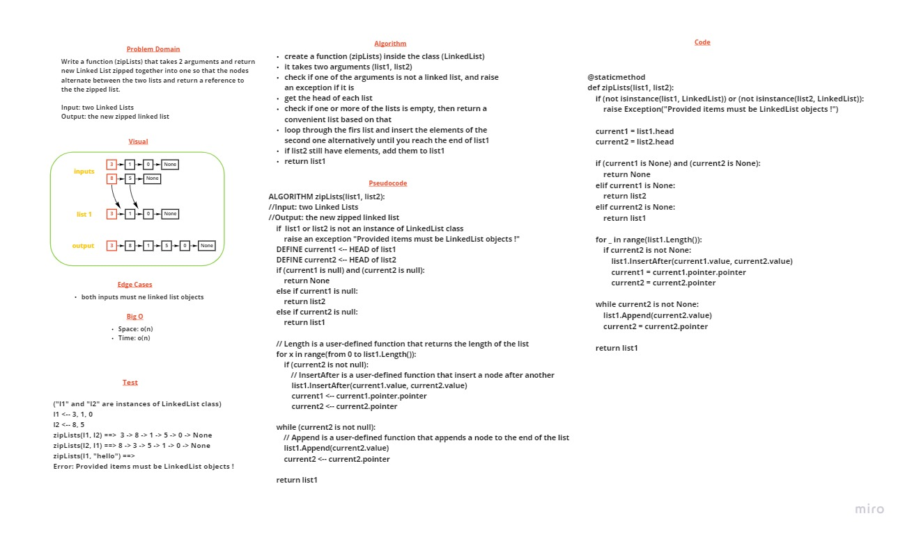

# Challenge 08 Summary: Linked List Zip

> [Back](../README.md)

---

Write a function called (zipLists) that takes 2 arguments and return new Linked List zipped together into one so that the nodes alternate between the two lists and return a reference to the the zipped list.

---

## Whiteboard Process



---

## Approach & Efficiency

create a function (zipLists) inside the class (LinkedList), it takes two arguments (list1, list2) 
check if one of the arguments is not a linked list, and raise an exception if it is, then get the head of each list
check if one or more of the lists is empty, then return a convenient list based on that loop through the firs list and insert the elements of the second one alternatively until you reach the end of list1
if list2 still have elements, add them to list1, then return list1

the big o for both time and space is o(n), because we always have to loop through the whole list

---

## Solution

### The code 

```
@staticmethod
def zipLists(list1, list2):
    """
    This function takes two linked lists as arguments, combine 
    them together alternetively, then return the new linked list
    """

    if (not isinstance(list1, LinkedList)) or (not isinstance(list2, LinkedList)):
        raise Exception("Provided items must be LinkedList objects !")

    current1 = list1.head
    current2 = list2.head

    if (current1 is None) and (current2 is None):
        return None
    elif current1 is None:
        return list2
    elif current2 is None:
        return list1

    for _ in range(list1.Length()):
        if current2 is not None:
            list1.InsertAfter(current1.value, current2.value)
            current1 = current1.pointer.pointer
            current2 = current2.pointer
        
    while current2 is not None:
        list1.Append(current2.value)
        current2 = current2.pointer

    return list1
```

### Test samples

```
def test_ziplists_for_identical_length_lists(my_linked_list, numeric_list):
    actual = str(LinkedList.zipLists(my_linked_list, numeric_list))
    expected = "Mustafa -> 0 -> Zaid -> 1 -> Ammar -> 2 -> NULL"
    assert actual == expected


def test_ziplists_for_list1_is_longer(my_linked_list, long_numeric_list):
    actual = str(LinkedList.zipLists(long_numeric_list, my_linked_list))  
    expected = "0 -> Mustafa -> 1 -> Zaid -> 2 -> Ammar -> 3 -> 4 -> 5 -> NULL"
    assert actual == expected


def test_ziplists_for_list2_is_longer(my_linked_list, long_numeric_list):
    actual = str(LinkedList.zipLists(my_linked_list, long_numeric_list)) 
    expected = "Mustafa -> 0 -> Zaid -> 1 -> Ammar -> 2 -> 3 -> 4 -> 5 -> NULL"
    assert actual == expected


def test_ziplists_for_one_list_is_empty(my_linked_list):
    assert str(LinkedList.zipLists(my_linked_list, LinkedList())) == "Mustafa -> Zaid -> Ammar -> NULL"
    assert str(LinkedList.zipLists(LinkedList(), my_linked_list)) == "Mustafa -> Zaid -> Ammar -> NULL"


def test_ziplists_for_providing_not_list():
    with pytest.raises(Exception):
        LinkedList.zipLists("hello", 5)
```

### The Fixtures

```
@pytest.fixture
def my_linked_list():
    ll = LinkedList()
    [ll.Append(Node(i)) for i in ["Mustafa", "Zaid", "Ammar"]]
    return ll

@pytest.fixture
def numeric_list():
    ll = LinkedList()
    [ll.Append(i) for i in range(3)]
    return ll

@pytest.fixture
def long_numeric_list():
    ll = LinkedList()
    [ll.Append(i) for i in range(6)]
    return ll
```