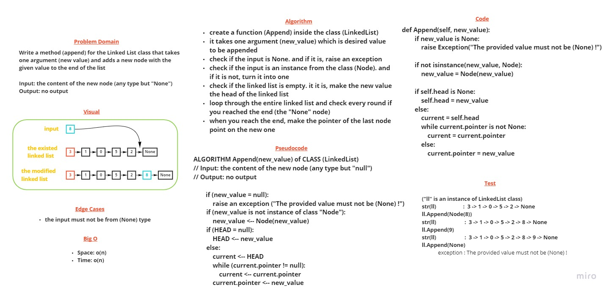

# The (Append) method in Linked List class

> [Back](README.md)

---

    Write a method (append) for the Linked List class that takes one argument (new value) and adds a new node with the given value to the end of the list

---

## Whiteboard Process

---

## Approach & Efficiency

First we check if the input is None. and if it is, we raise an exception. then check if the input is an instance from the class (Node). and if it is not, we turn it into one. then we check if the linked list is empty. if it is, make the new value the head of the linked list. 

then we loop through the entire linked list and check every round if you reached the end (the "None" node)
when you reach the end, make the pointer of the last node point on the new one

the big o for both time and space is o(n), because the worst case is to loop through the whole list

---

## Solution

### The code 

    def Append(self, value):
        """
        This function inserts a value (Node instance) at 
        the (end) of the linked list

        The (value) can be either (Node) instances or 
        any other type, because the method will turn 
        everything to a (Node) instance if it wasn't. 
        """

        if value is None:
            raise Exception("The provided value must not be (None) !")

        if not isinstance(value, Node):
            value = Node(value)

        if self.head is None:
            self.head = value
        else:
            current = self.head
            while current.pointer is not None:
                current = current.pointer
            else:
                current.pointer = value

### Test samples

    def test_appending_to_linked_list(my_linked_list):
        my_linked_list.Append(Node("Barham"))
        assert str(my_linked_list) == "Mustafa -> Zaid -> Ammar -> Barham -> NULL"

    def test_providing_not_node_instance_for_append_method(my_linked_list):
        my_linked_list.Append("Barham")
        assert str(my_linked_list) == "Mustafa -> Zaid -> Ammar -> Barham -> NULL"

    # fixture

    @pytest.fixture
    def my_linked_list():
        ll = LinkedList()
        [ll.Append(Node(i)) for i in ["Mustafa", "Zaid", "Ammar"]]
        return ll

   