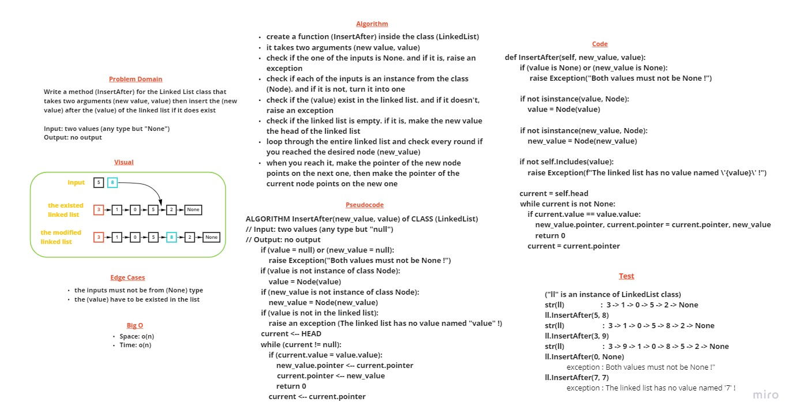

# The (InsertAfter) method in Linked List class

> [Back](README.md)

    Write a method (InsertAfter) for the Linked List class that takes two arguments (new value, value) then insert the (new value) after the (value) of the linked list if it does exist

---

## Whiteboard Process

---

## Approach & Efficiency

check if the one of the inputs is None. and if it is, raise an exception. check if each of the inputs is an instance from the class (Node). and if it is not, turn it into one. check if the (value) exist in the linked list. and if it doesn't, raise an exception. check if the linked list is empty. if it is, make the new value the head of the linked list

loop through the entire linked list and check every round if you reached the desired node (new_value)
when you reach it, make the pointer of the new node points on the next one, then make the pointer of the current node points on the new one

the big o for both time and space is o(n), because the worst case is to add value after the last node

---

## Solution

### The code

    def InsertAfter(self, new_value, value):
        """
        This function inserts the (new value) after the 
        (value) of the linked list if it does exist
        """

        if (value is None) or (new_value is None):
            raise Exception("Both values must not be None !")
        
        if not isinstance(value, Node):
            value = Node(value)

        if not isinstance(new_value, Node):
            new_value = Node(new_value)

        if not self.Includes(value):
            raise Exception(f"The linked list has no value named \'{value}\' !")

        current = self.head
        while current is not None:
            if current.value == value.value:
                new_value.pointer, current.pointer = current.pointer, new_value
                return 0
            current = current.pointer

### The sample test

        def test_inserting_a_node_after_the_last_node(my_linked_list):
            my_linked_list.InsertAfter("Barham", "Ammar")
            assert str(my_linked_list) == "Mustafa -> Zaid -> Ammar -> Barham -> NULL"

        def test_inserting_a_node_after_a_specific_other_node(my_linked_list):
            my_linked_list.InsertAfter("Barham", "Zaid")
            assert str(my_linked_list) == "Mustafa -> Zaid -> Barham -> Ammar -> NULL"

---
