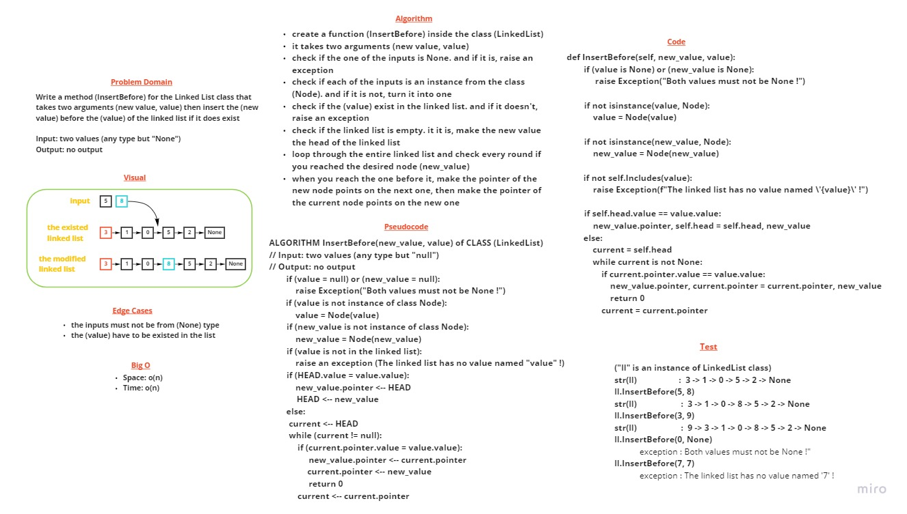

# The (InsertBefore) method in Linked List class

> [Back](README.md)

Write a method (InsertBefore) for the Linked List class that takes two arguments (new value, value) then insert the (new value) before the (value) of the linked list if it does exist

---

## Whiteboard Process

---

## Approach & Efficiency

check if one of the inputs is None. and if it is, raise an exception. check if each of the inputs is an instance from the class (Node). and if it is not, turn it into one. check if the (value) exist in the linked list. and if it doesn't, raise an exception. check if the linked list is empty. it it is, make the new value the head of the linked list

loop through the entire linked list and check every round if you reached the desired node (new_value). when you reach it, make the pointer of the new node points on the next one, then make the pointer of the current node points on the new one

the big o for both time and space is o(n), because the worst case is to add value before the last node

---

## Solution

### The code 

    def InsertBefore(self, new_value, value):
        """
        This function inserts the (new value) before the 
        (value) of the linked list if it does exist
        """
        
        if not isinstance(value, Node):
            value = Node(value)
        
        if not isinstance(new_value, Node):
            new_value = Node(new_value)

        if not self.Includes(value):
            raise Exception(f"The linked list has no value named \'{value}\' !")

        if (value is None) or (new_value is None):
            raise Exception("Both values must not be None !")

        if self.head.value == value.value:
            new_value.pointer, self.head = self.head, new_value
        else:
            current = self.head
            while current is not None:
                if current.pointer.value == value.value:
                    new_value.pointer, current.pointer = current.pointer, new_value
                    return 0
                current = current.pointer

### The test samples

    def test_inserting_a_node_before_a_specific_other_node(my_linked_list):
        my_linked_list.InsertBefore("Barham", "Zaid")
        assert str(my_linked_list) == "Mustafa -> Barham -> Zaid -> Ammar -> NULL"

    def test_inserting_a_node_before_the_head(my_linked_list):
        my_linked_list.InsertBefore("Barham", "Mustafa")
        assert str(my_linked_list) == "Barham -> Mustafa -> Zaid -> Ammar -> NULL"

    # fixures 
    @pytest.fixture
    def my_linked_list():
        ll = LinkedList()
        [ll.Append(Node(i)) for i in ["Mustafa", "Zaid", "Ammar"]]
        return ll